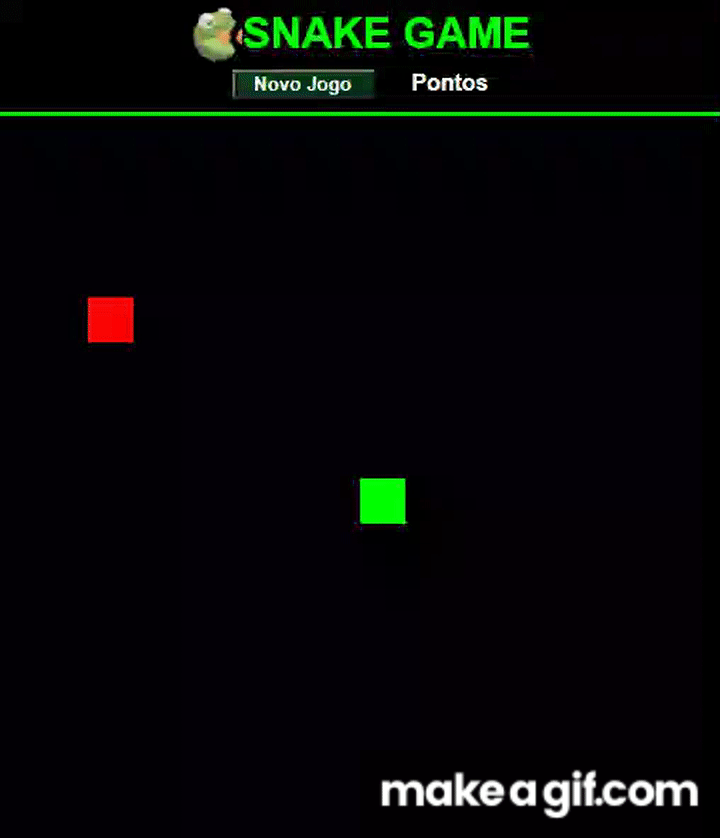

<h1 align="center">
:small_red_triangle_down: Snake Game | Jogo da Cobrinha com JavaScript
<h3 align="center">
Bootcamp Global FullStack Developer da Digital Innovation One
</h3>
</h1>

<p align="center">
  

  
</p>

<p>
O objetivo deste projeto é recriar o jogo da cobrinha com JavaScript. É um desafio prático do Bootcamp Global FullStack Developer disponibilizado pela <b>Digital Innovation One</b> cujo objetivo é formar desenvolvedores para estarem para atuar nas 10 nações que falam a língua portuguesa.
</p>

<p align="center">
  <a href="#cloud-deploy">Deploy</a>&nbsp;&nbsp;&nbsp;|&nbsp;&nbsp;&nbsp;
  <a href="#rocket-tecnologias">Tecnologias</a>&nbsp;&nbsp;&nbsp;|&nbsp;&nbsp;&nbsp;
  <a href="#computer-instalando">Instalando</a>&nbsp;&nbsp;&nbsp;|&nbsp;&nbsp;&nbsp;
  <a href="#books-aprendendo">Aprendendo</a>&nbsp;&nbsp;&nbsp;|&nbsp;&nbsp;&nbsp;
  <a href="#small_orange_diamond-contribuindo">Contribuindo</a>&nbsp;&nbsp;&nbsp;|&nbsp;&nbsp;&nbsp;
  <a href="#small_orange_diamond-customizando">Customizando</a>&nbsp;&nbsp;&nbsp;|&nbsp;&nbsp;&nbsp;
  <a href="#small_orange_diamond-licença">Licença</a>&nbsp;&nbsp;&nbsp;|&nbsp;&nbsp;&nbsp;
  <a href="#small_orange_diamond-trello">Trello</a>
</p>

<p align="center">
  
</p>

## :cloud: Deploy
  
Foi usado o servidor Heroku para o deploy da aplicação. Para testar a aplicação acesse:

- [https://cd-snake-game.herokuapp.com/](https://cd-snake-game.herokuapp.com/)

## :rocket: Tecnologias

Nesse projeto foram usadas as seguintes tecnologias:

- [Html5](https://developer.mozilla.org/pt-BR/docs/Web/HTML/HTML5)
- [Css3](http://www.linhadecodigo.com.br/artigo/3566/introducao-as-novidades-do-css3.aspx)
- [JavaScript](https://developer.mozilla.org/pt-BR/docs/Web/JavaScript)
- [Canvas](https://developer.mozilla.org/pt-BR/docs/Web/HTML/Canvas)

## :computer: Instalando

1. Faça o clone deste repositório numa pasta desejada.
2. Execute o arquivo 'index.html' em um navegador.

## :books: Aprendendo

- A importância de commitar após pequenas implementações para ajudar no debug.
- Meu primeiro contato com a API Canvas.

## :small_orange_diamond: Contribuindo

1. Para impedir que as teclas sejam acionadas fora do gramado altere a função <b>'update()'</b>:

```javascript
    function update(event) {

    // Cobrinha fora do contexto
    if (snake[0].x > 15 * box && direction == "right" 
        || snake[0].x < 0  && direction == "left" 
        || snake[0].y > 15 * box && direction == "down" 
        || snake[0].y < 0 && direction == "up") 
    { 
        // Ignora ações das teclas até voltar para o contexto
    }
    else {
        // Altera a direção pelas teclas
        if (event.keyCode == 37 && direction != "right") direction = "left";
        if (event.keyCode == 38 && direction != "down") direction = "up";
        if (event.keyCode == 39 && direction != "left") direction = "right";
        if (event.keyCode == 40 && direction != "up") direction = "down";
    }
}
```

2. Para aprender a usar imagens no canvas poderá acessar o site da DevMedia listado abaixo:

- [DevMedia | HTML5 - A tag CANVAS](https://www.devmedia.com.br/html5-a-tag-canvas/25413)

## :small_orange_diamond: Customizando

1. Adição de comentários no código.
2. Alteração da função update para impedir o uso das teclas fora do gramado.
3. Alteração das cores do jogo com efeito degradê no corpo da cobrinha.
4. Padronização do nome das funções para inglês.
5. Criação da logo.

## :small_orange_diamond: Licença

Esse projeto está sob a licença MIT. Veja o arquivo [LICENSE](LICENSE.md) para mais detalhes.
A(s) imagem(s) usadas neste projeto são originais do autor ou foram obtidas do Google Imagens com a devida autorização para uso gratuito com modificação.

## :small_orange_diamond: Trello

<p align="center">
  
</p>

## :small_orange_diamond: Agradecimentos

Quero agradecer a <b>Digital Innovation One</b> pelas contribuições para o meu aprendizado neste projeto. Parabéns pelo trabalho de vocês. 

Muito obrigado!:clap::clap:
